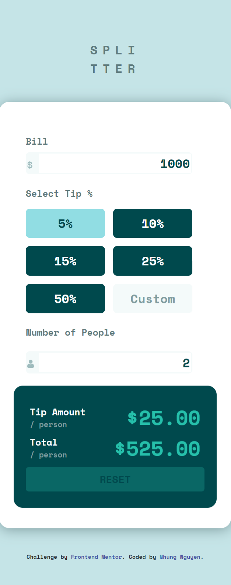

# Frontend Mentor - Tip calculator app solution

This is a solution to the [Tip calculator app challenge on Frontend Mentor](https://www.frontendmentor.io/challenges/tip-calculator-app-ugJNGbJUX). Frontend Mentor challenges help you improve your coding skills by building realistic projects.

## Table of contents

- [Overview](#overview)
  - [The challenge](#the-challenge)
  - [Screenshot](#screenshot)
  - [Links](#links)
- [My process](#my-process)
  - [Built with](#built-with)
  - [What I learned](#what-i-learned)
  - [Continued development](#continued-development)
  - [Useful resources](#useful-resources)
- [Author](#author)

## Overview

### The challenge

Users should be able to:

- View the optimal layout for the app depending on their device's screen size
- See hover states for all interactive elements on the page
- Calculate the correct tip and total cost of the bill per person

### Screenshot

### Links

- Solution URL: [solution URL](https://github.com/rose-de-pur-nguyen/-frontend-mentor-tip-calculator.git)
- Live Site URL: [Add live site URL here](https://your-live-site-url.com)

## My process

### Built with

- Semantic HTML5 markup
- CSS custom properties
- Flexbox
- CSS Grid
- Mobile-first workflow
- Javascript
- Bootstrap

### What I learned

- A lot of JS

### Continued development

- of coure is still JS, this calculator got my joy. i met quite obstacles but feel so happy that finally finish it

### Useful resources

- Gemini - Google AI assistant helps me to answer all your questions clearly and directly. think that i couldn't manage to overcome this without it 

## Author

- Frontend Mentor - [@rose-de-pur-nguyen](https://www.frontendmentor.io/profile/rose-de-pur-nguyen)

